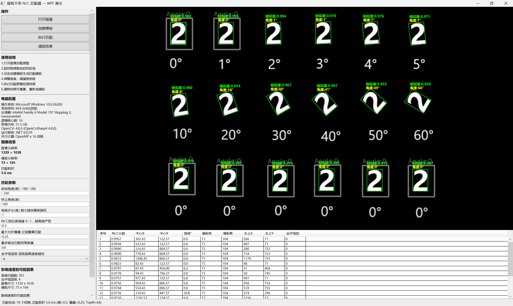

WPF+C++ 自研旋转 NCC 模板匹配源码｜工业机器视觉定位｜金字塔多级加速｜OpenMP 并行
标签
WPF、NCC 模板匹配、轮廓匹配扩展、缺陷检测、C++ 算法、旋转不变匹配、机器视觉、OpenCV、工控上位机、Mark 点定位、半导体视觉、元器件定位
商品详情（最终定稿・专业完整版）
工业级视觉一体化 Demo 工程：WPF 交互上层 + C++ 手写 NCC 核心算法，内置NCC 灰度匹配、缺陷检测两套完整链路，预留轮廓匹配扩展入口。NCC 部分不套壳 OpenCV matchTemplate原生接口。
市面上绝大多数 Demo 仅简单循环调用 OpenCV 自带 matchTemplate 做旋转匹配，重复计算多、缓存差、策略固化，很难直接落地产线。本项目归一化互相关、角度遍历、搜索策略全部自研；缺陷检测完整实现；轮廓匹配给出完整技术框架，方便二次开发。
✅ 整体项目架构
上层：C#‑WPF 工控可视化上位机
完整可视化操作界面：图片批量加载、模板 ROI 创建、一键执行匹配、结果清空重置
三大功能模块可切换：NCC 灰度模板匹配 / 缺陷检测 / 轮廓匹配（预留扩展）
全参数开放可调：金字塔层级、角度起止区间、角度步长、NCC 相似度阈值、重叠抑制系数、缺陷灵敏度参数、最大输出匹配数量
实时渲染结果：匹配包围框、旋转角度、相似度分数、缺陷标记红框；支持图像缩放漫游查看细节
结构化结果输出：目标中心 XY、框左上角坐标、模板宽高、旋转角度、NCC 得分、匹配层级、缺陷类型、缺陷面积，可直接对接运动控制逻辑
预留算法切换接口：UI 层可下拉切换匹配算法，便于现场根据工况选用灰度 NCC 或者轮廓匹配
底层：C++ 高性能算法库（核心资产）
自研旋转 NCC 灰度匹配模块（完整源码）
自研旋转不变归一化互相关 NCC，支持‑180° ~ +180° 全角度工件定位，不依赖 OpenCV matchTemplate 接口
模板旋转缓存：每个角度模板仅计算一次，避免重复旋转插值，降低算力消耗
高斯金字塔粗搜‑精搜两级搜索，兼顾速度与检出率，减少漏检
OpenMP 多线程并行角度遍历，多核加速，多目标毫秒级输出
自研 IOU‑NMS 非极大值抑制，按重叠面积过滤重复目标
分级搜索策略：大范围低分粗筛 + 局部小窗口高精度求精
兜底全图扫描，应对低对比度、复杂背景工况
工业测速：仅统计核心算法耗时，剔除 UI、图像解码开销
模板对齐后缺陷检测模块（完整源码）
先通过 NCC 定位工件位置与旋转角度，把模板与检测图像仿射对齐后再做差分缺陷分析
图像仿射矫正：将待检图像旋转平移，与标准模板位置姿态对齐
灰度差分比对：对齐后逐区域灰度差异运算
形态学处理：腐蚀、膨胀，过滤噪点，连通域分析
缺陷过滤：面积阈值、亮度阈值，区分真实缺陷与噪声伪缺陷
缺陷分类识别：划痕、污渍、缺损、异物，输出缺陷位置、面积、类型
参数全部开放：差值阈值、边缘容差、腐蚀膨胀核、最小缺陷面积可界面调节
轮廓匹配模块（完整技术框架 + 开发指引，预留扩展）
当前工程不直接内置成品轮廓匹配可执行算法，提供完整开发框架与流程注释，基于轮廓点集 + 距离变换路线，可快速开发完成。
模板轮廓学习链路：灰度降噪、二值、FindContours 轮廓提取、轮廓简化 ApproxPolyDP、轮廓质心归一化
检测链路框架：Canny 边缘、距离变换 DistanceTransform、角度循环旋转轮廓点集、滑动质心代价计算
金字塔适配、NMS 结果去重接口已经预留，可复用现有 NCC 的金字塔、并行、NMS 后处理基础设施
输出格式与 NCC 完全统一：X/Y/Angle/Score，上层 UI 无需改动即可接入
✅ 三种能力技术对比（UI 内也可作为说明备注）
表格
能力	NCC 灰度匹配（完整实现）	轮廓点集匹配（框架可扩展）	基于模板对齐缺陷检测（完整实现）
原理	逐像素灰度归一化互相关	边缘轮廓点集 + 距离变换代价	工件姿态对齐后图像差分连通域分析
光照鲁棒性	较差，光照剧烈漂移得分下降	优秀，只依赖边缘外形	依赖 NCC 定位精度，光照影响差分结果
擅长场景	光源稳定，依靠纹理 / 灰度区分工件	光照波动大，只关心外形轮廓，不在乎内部纹理	印刷字符、药袋、元器件表面划痕污渍缺损检测
速度	快，C++ 自研 + 缓存 + OpenMP，多目标毫秒级	中等，边缘提取 + 点集运算，比 NCC 慢	中等，依赖前面定位耗时，差分与形态学运算较快
局限	外形相同纹理不同会混淆	外形一致内部图案不同无法区分	定位不准会造成误检，需要稳定匹配结果做前置
选型建议：光源稳定优先 NCC；光照波动大优先扩展轮廓匹配；缺陷检测依赖前面匹配输出的位置角度做图像矫正。
✅ 核心差异化优势（对比网上 Demo）
NCC 算法完全自研，没有套 OpenCV 原生 matchTemplate，NCC 计算公式、搜索逻辑可随意修改适配非标工件。
一整套工业流水线：定位 → 姿态矫正 → 缺陷检测完整链路，不只是单纯模板匹配 Demo。
C++ 底层运算，性能远超 C# OpenCvSharp 版本，适合 7×24 小时产线运行。
轮廓匹配提供完整工程框架，复用现有金字塔、并行、NMS 基础设施，降低二次开发工作量。
全部参数 UI 可视化可调，不需要反复修改源码调试现场工况。
输出旋转角度，直接对接运动平台角度对位，适配探针台、编带机等设备。
✅ 实测效果（截图均为本软件实拍运行结果，无修图）
输液袋印刷字符旋转定位；
半导体元器件批量 Mark 点多目标定位；
字符多角度匹配，同时完成划痕、污渍、缺损缺陷检出；
示例：18 个多角度目标，定位 + 缺陷检测整套流程仅数毫秒，满足高速产线节拍。
补充：NCC 灰度匹配对剧烈光照变化敏感；遇到光照波动工况，可基于本项目现有框架快速接入轮廓匹配模块。
🎯 适用工业业务场景
半导体探针台视觉对位、编带机元器件定位、PCB Mark 点定位、药袋印刷检测、物料旋转对位、印刷字符定位检测、电子元器件划痕污渍缺损外观检测，各类 C# 工控上位机视觉模块。
源码可直接二次商用开发，不需要从零搭建算法底座。
📦 全套交付清单
完整 Visual Studio 整套解决方案（C# WPF 项目 + C++ 算法库项目）
C++ 完整源码：
  ①自研旋转 NCC 全套（NCC 计算、模板旋转缓存、高斯金字塔、OpenMP 并行搜索、NMS 非极大抑制）
  ②缺陷检测全套（仿射对齐、差分比对、形态学、连通域缺陷分析）
  ③轮廓匹配完整开发框架、接口定义、详细注释开发指引
WPF C# 上位机完整界面源码，图像显示、绘图交互、参数绑定、结果展示
C++ ↔ C# 互调用封装、统一结构体定义（NCC 结果、缺陷结果、轮廓匹配预留结构体）
配套测试图像样本、编译配置文档、算法选型说明文档
OpenCV4.8 依赖库，编译开箱运行
⚠️ 授权说明
底层仅依赖 OpenCV 基础图像算子（高斯模糊、插值、轮廓、形态学等基础接口），无第三方商业视觉 SDK、无加密、无代码阉割、无授权锁，个人、企业商业项目均可直接使用。
重要提示：
NCC 灰度匹配、缺陷检测为完整可直接运行源码；轮廓匹配提供完整工程框架与开发指引，需要在此基础上完成业务逻辑编码，不属于开箱即用成品算法。
不是网上简单套 OpenCV matchTemplate 循环的 Demo，整套搜索、后处理基础设施全部自研，适合机器视觉上位机工程师迭代二次开发。
